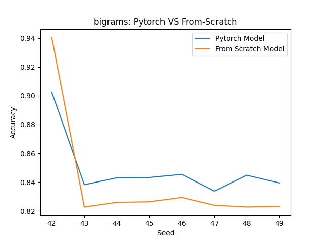
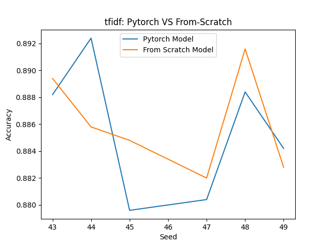
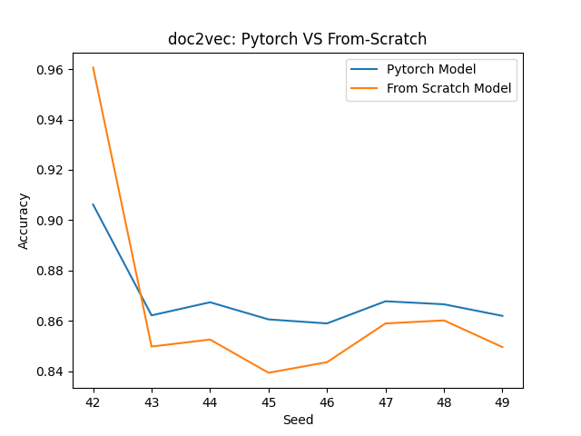
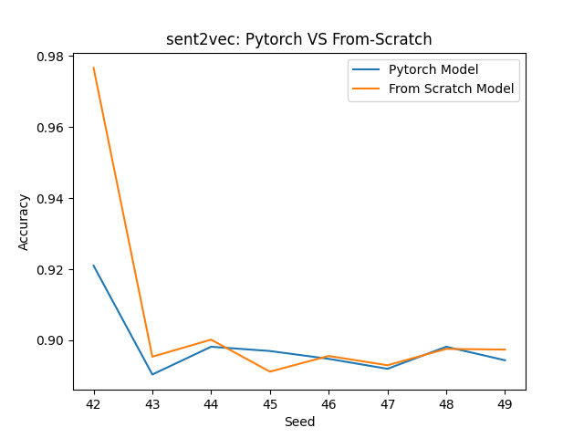
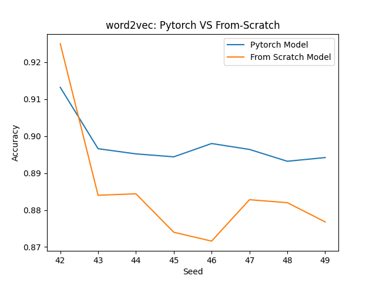

# Description

---

This project is for a data mining class where we have to implement a data mining
method from scratch without using any libraries. This is my implementation of a
simple autograd engine.

# OptTensor

---

Autograd Engine using numpy for training Neural Network.\
From Scratch Implementation of Pytorch Tensors supporting the following
operation.

1. MatMul
2. BinaryLoss
3. Softmax
4. Relu

# Installation

---

Run `pip install -e .` in the main directory.

# Results

---

Comparision of from scratch implementation with pytorch's tensor on a simple MLP
for a NLP classification task on different work embedding.

\
\
\
\
\
